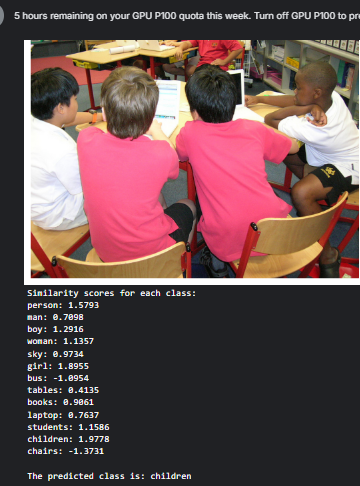

# CLIP Model: Training and Evaluation

This repository contains the implementation and evaluation of a custom CLIP(https://arxiv.org/abs/2103.00020) (Contrastive Language-Image Pretraining) model, trained using a Vision Transformer (ViT) on the COCO dataset. The CLIP model architecture was adapted from **Stable Diffusion**(https://github.com/Stability-AI/stablediffusion) and modified with a custom training logic defined in the `train` folder.

## Overview

The CLIP model was trained using a Vision Transformer (ViT) backbone and achieved the following results:

| Model       | Final Loss | Dataset | Batch Size | Epochs |
|-------------|------------|---------|------------|--------|
| CLIP Paper  | 0.47       | COCO    | 4096       | 30     |
| **Our Model** | **0.72**   | **COCO**    | **1024**       | **85**     |

### Training Details

- **Resource Utilization**:  
  Training was conducted on an NVIDIA Tesla P100 GPU with 16 GiB of RAM, consuming approximately 150 GPU hours.
- **Training Configuration**:  
  - **Batch Size**: 1024 (one-fourth of the original CLIP paper's batch size).  
  - **Epochs**: 85 (to compensate for the reduced batch size and GPU power).  
  - **Final Loss**: 0.72.  

Despite hardware limitations, the extended training period ensured effective convergence, as demonstrated by the consistent decline in the loss curve.

## Notes

- The training logic was implemented from scratch and is organized in the `src/train/` folder. This folder contains all scripts related to the dataset, data loading, and training loop. If you are interested in retraining or exploring the training logic make sure to review this folder.
- The `evaluate.py` script is designed to work seamlessly with the pre-trained model and requires no additional setup beyond specifying the image path (optional).


## Running the Model
To evaluate the CLIP model:

1. Clone this repository:
   ```bash
   git clone https://github.com/theSohamTUmbare/CLIP-model.git
   cd CLIP-model
   ```

2. Install the required dependencies:
   ```bash
   pip install -r requirements.txt
   ```

3. Run the `evaluate.py` script:
   ```bash
   python evaluate.py
   ```

### Changing the Input Image
To evaluate the model on a different image, modify the `image_path` variable in `evaluate.py` to point to the desired image.

### Example Output
The script will:
- Display the input image.
- Print similarity scores for each class label.
- Output the best-matching class based on the computed similarity scores.




## Citation
If you use this work, please acknowledge the CLIP paper and the Stable Diffusion project as inspirations for the architecture and training pipeline.

**CLIP Paper**: Radford et al., ["Learning Transferable Visual Models From Natural Language Supervision"](https://arxiv.org/abs/2103.00020)

**Stable Diffusion**: https://github.com/Stability-AI/stablediffusion

---

🧑‍💻 Happy Experimenting! 🔬
